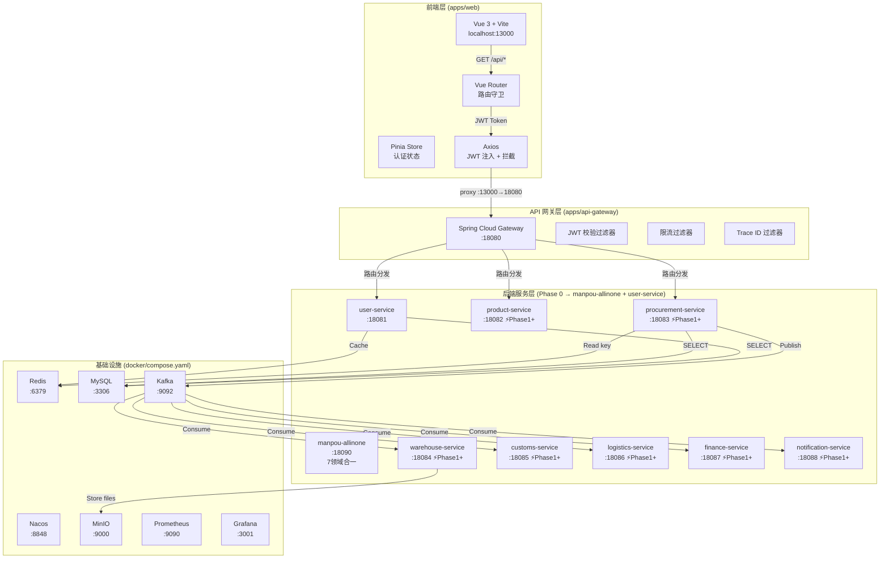
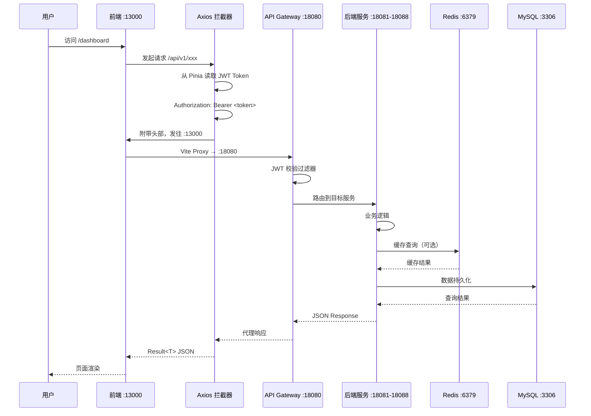
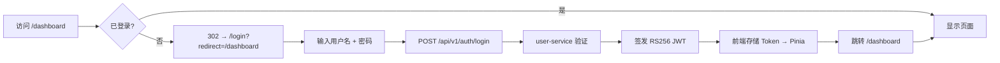
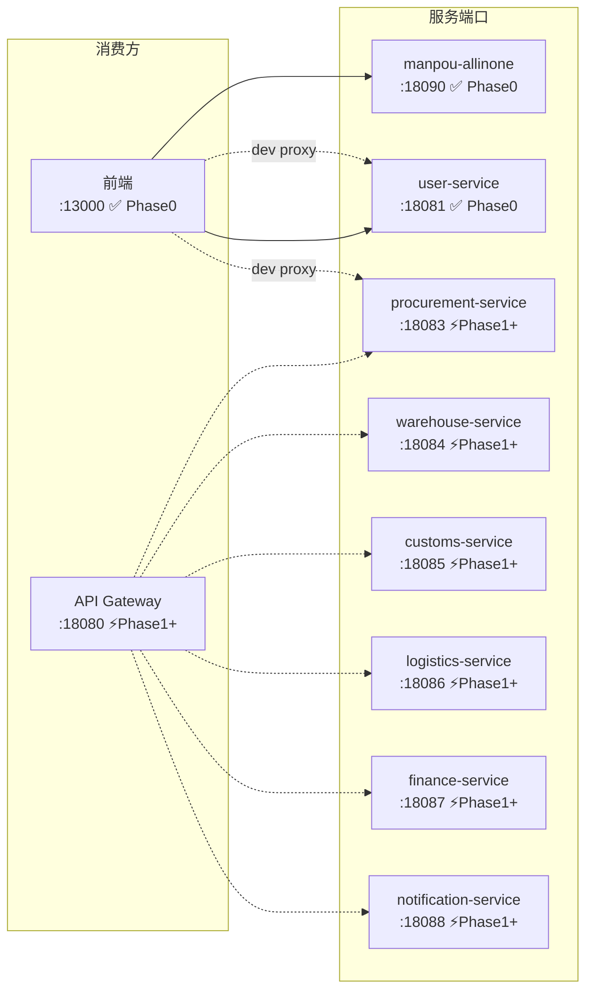
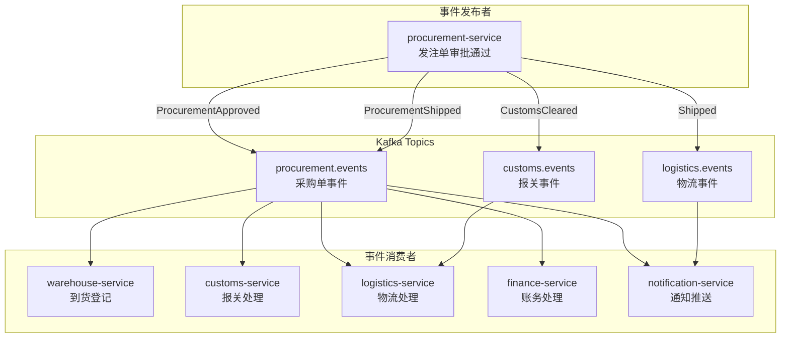
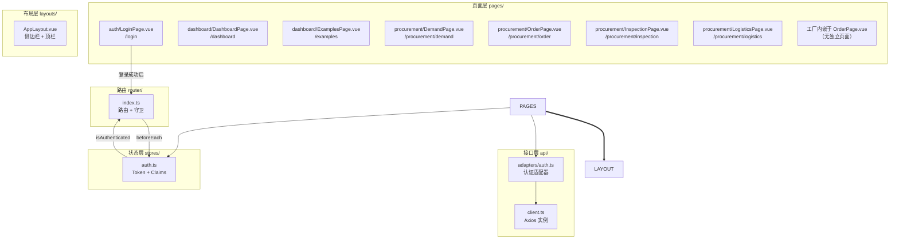

# 系统架构图

> MANPOU 企业管理系统完整架构（前端视角）

---

## 1. 整体架构

---

## 2. 前端请求流程

---

## 3. 认证流程

---

## 4. 微服务端口映射

> **Phase 0**：所有七域合一部署在 **manpou-allinone**（18090），前端直连。
> **Phase 1+**：按 Kafka Topic 边界拆分各域为独立微服务（18083-18088），接入 API Gateway（18080）。

---

## 5. 领域事件流（Kafka）

---

## 6. 前端项目内部架构

---

## 7. 基础设施组件

| 组件 | 端口 | 用途 | 当前状态 |
|------|------|------|---------|
| MySQL | 3306 | 业务数据持久化 | Docker 可用 |
| Redis | 6379 | 缓存 + 会话（health 检查依赖） | Docker 可用 |
| Kafka | 9092 | 领域事件消息队列 | Docker 可用 |
| Nacos | 8848 | 配置中心 + 注册中心 | Docker 可用 |
| MinIO | 9000 | 对象存储（货物照片） | Docker 可用 |
| Prometheus | 9090 | 指标采集 | Docker 可用 |
| Grafana | 3001 | 可视化监控 | Docker 可用 |

> 本地开发不需要启动 Docker，各服务独立运行。Docker/K8s 空间已预留。

---

*相关文档：[docs/ui/README.md](README.md)*
